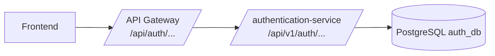

# authentication-service

## Arquitectura en capas

El proyecto fue reorganizado a arquitectura en capas con estos paquetes:

- `config`
- `controller`
- `dto.request`
- `dto.response`
- `entity`
- `exception`
- `mapper`
- `repository`
- `repository.impl`
- `service.interfaces`
- `service.impl`

Estructura principal:

```text
src/main/java/com/logistics/authentication/
  config/
  controller/
  dto/
    request/
    response/
  entity/
  exception/
  mapper/
  repository/
    impl/
  service/
    interfaces/
    impl/
```

## Integracion con API Gateway

Este servicio ya esta preparado para ejecutarse detras del gateway:

- Usa `server.forward-headers-strategy=framework`.
- Genera links HAL con URL externa (gateway) respetando `X-Forwarded-*`.
- Se configura por perfil con `.env.dev` y `.env.prod`.

## Variables por perfil

- Desarrollo local: `.env.dev`
- Produccion: `.env.prod`
- Pruebas rápidas sin Postgres: perfil `local` (H2 en memoria)

## Prueba rápida con Swagger + H2

Levantar el servicio con H2:

```bash
mvn spring-boot:run -Dspring-boot.run.profiles=local
```

Abrir Swagger:

- `http://localhost:8080/swagger-ui.html`

Flujo sugerido de pruebas:

1. `POST /api/v1/auth/register`
  Body ejemplo:
  ```json
  {
    "nombre": "Juan",
    "apellido": "Perez",
    "telefono": "+573001112233",
    "email": "juan.perez@correo.com",
    "password": "password123"
  }
  ```

2. `POST /api/v1/auth/login`
  Usa el usuario recién creado o el semilla:
  - email: `admin@logistics.com`
  - password: `password123`

3. Copiar `accessToken` en Swagger (`Authorize`):
  - Valor: `Bearer <accessToken>`

4. `GET /api/v1/auth/me`
  - Valida identidad y roles del token.

5. `POST /api/v1/auth/refresh`
  - Enviar el `refreshToken` recibido en login.
  - Verifica rotación de access/refresh.

Validaciones rápidas esperadas:

- Registro con `email` repetido -> `409 AUTH_EMAIL_ALREADY_EXISTS`
- Registro con `telefono` repetido -> `409 AUTH_PHONE_ALREADY_EXISTS`
- Login con password inválido -> `401 AUTH_INVALID_CREDENTIALS`

Opcional (inspección DB local):

- Consola H2: `http://localhost:8080/h2-console`
- JDBC URL: `jdbc:h2:mem:authlocal`
- User: `sa`
- Password: vacío

Arranque local del auth-service:

```bash
SPRING_PROFILES_ACTIVE=dev ./mvnw spring-boot:run
```

Arranque local solo de auth con su base:

```bash
docker compose up -d --build
```

## Mapa de rutas (gateway -> auth-service)

Rutas publicas del gateway:

- `POST /api/auth/login` -> `POST /api/v1/auth/login`
- `POST /api/auth/refresh` -> `POST /api/v1/auth/refresh`
- `GET /api/auth/me` -> `GET /api/v1/auth/me`
- `GET /api/auth/admin/**` -> `GET /api/v1/admin/**`
- `GET /api/auth/v3/api-docs` -> `GET /v3/api-docs`
- `GET /api/auth/swagger-ui/**` -> `GET /swagger-ui/**`



## Stack combinado (gateway + auth + db)

Para levantar todo junto, usa el compose del gateway:

```bash
cd ../gateway-service
cp .env.example .env
docker compose up -d --build
```

Gateway local:

- `http://localhost:8080`

## Recomendaciones de integracion

- Expon al frontend solo el dominio del gateway.
- En `CORS_ORIGINS` usa el origen publico del frontend/gateway.
- `8080` puede seguir siendo puerto interno del microservicio, pero en produccion no lo publiques directo a internet.